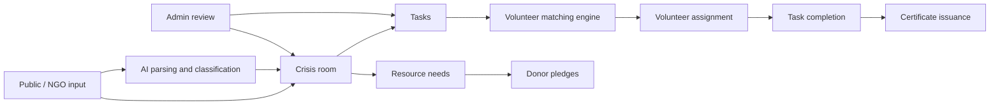

# RahatSetu AI

RahatSetu AI is a disaster relief coordination platform built as a hackathon MVP. It brings NGOs, volunteers, donors, crisis response rooms, resource pledges, AI-assisted intake, and certificate-based volunteer recognition into one operational dashboard.

The product is designed to help communities respond faster when a fire, flood, landslide, earthquake, or cyclone creates fragmented needs across people, supplies, and field teams.

## Problem Statement

During disasters, help often arrives in scattered, unstructured ways:

- NGOs struggle to coordinate incoming volunteers and donations.
- Citizens want to help, but do not know what is actually needed.
- Donors cannot easily see verified needs.
- High-risk tasks may be assigned informally without safety checks.
- Public reports, offers, and resource information get lost across calls, chats, and spreadsheets.

This leads to duplication, delays, poor routing of resources, and reduced trust during the most critical hours of response.

## Solution

RahatSetu AI acts as a command-center style coordination layer for relief operations.

- NGOs can create crisis rooms, post tasks, publish resource needs, and manage impact.
- Volunteers can maintain structured profiles, receive assignments, and earn certificates.
- Donors can view verified needs, pledge supplies, and support campaigns.
- Admins can review reports, verify actors, and approve sensitive tasks.
- AI helpers convert unstructured text into usable operational data.

## SDG Mapping

RahatSetu AI aligns most directly with these UN Sustainable Development Goals:

- `SDG 3: Good Health and Well-being` by helping route medical support, triage, medicines, and safer volunteer deployment.
- `SDG 9: Industry, Innovation and Infrastructure` by digitizing crisis coordination workflows.
- `SDG 11: Sustainable Cities and Communities` by improving resilience and local response capacity.
- `SDG 13: Climate Action` by supporting response during climate-linked emergencies such as floods and cyclones.
- `SDG 17: Partnerships for the Goals` by connecting NGOs, volunteers, donors, and local communities on one platform.

## Features

- Crisis command-center landing page for fire, flood, landslide, earthquake, and cyclone response
- Role-based login and registration for `NGO`, `Volunteer`, `Donor`, and `Admin`
- NGO dashboard with crisis stats, volunteer matches, resource board, and impact summary
- Crisis creation flow with disaster-specific template suggestions
- Task creation with risk-level handling and skill or asset suggestions
- Volunteer dashboard with task requests, assigned work, completed work, certificates, and profile editing
- Volunteer matching engine with weighted ranking and human-readable reasons
- AI-assisted volunteer skill extraction, NGO need parsing, and crisis report classification
- Resource need board and donor pledge flow
- Campaign help page with money donation placeholder in demo mode
- Crisis impact dashboard with metrics and report export placeholder
- Admin review panel for verification, suspicious reports, red-risk task approval, and active crisis monitoring
- Printable certificate pages with share and PDF placeholder actions
- LocationIQ-ready crisis map with graceful fallback when no API key is configured
- Privacy, safety, loading, empty, and error states across the app

## Tech Stack

- `Next.js 16.2.4` with App Router
- `React 19.2.4`
- `TypeScript 5`
- `Tailwind CSS 4`
- `Firebase Authentication`
- `Cloud Firestore`
- `Firebase Storage` placeholder
- `LocationIQ` integration for interactive map
- `Gemini API` integration for structured AI helpers

## Architecture

### Frontend

- App Router pages under `app/`
- Reusable UI components under `components/`
- Shared domain types under `types/`
- Mock and demo content under `data/` and `lib/demoData.ts`

### Backend Services

- Firebase Auth for registration and sign-in
- Firestore as the main operational datastore
- Server-side AI route for Gemini-backed structured extraction

### Core Firestore Collections

- `users`
- `crises`
- `tasks`
- `resourceNeeds`
- `resourcePledges`
- `matches`
- `certificates`
- `notifications`

### High-Level Flow



## Firebase Setup

### 1. Create a Firebase project

- Go to the [Firebase Console](https://console.firebase.google.com/)
- Create a new project
- Enable `Authentication`
- Enable `Firestore Database`

### 2. Enable authentication providers

For the current MVP, enable:

- `Email/Password`

### 3. Create Firestore database

- Start in development mode for local testing
- Choose a region close to your demo audience

### 4. Add a web app

From project settings, create a web app and copy the Firebase configuration values into `.env.local`.

### 5. Recommended Firestore collections

The app expects the following collections during real usage:

- `users`
- `crises`
- `tasks`
- `resourceNeeds`
- `resourcePledges`
- `matches`
- `certificates`
- `notifications`

### 6. Security rule draft

This is a starter draft for MVP development. It should be tightened further before any production deployment.

```txt
rules_version = '2';
service cloud.firestore {
  match /databases/{database}/documents {
    function signedIn() {
      return request.auth != null;
    }

    function userDoc() {
      return get(/databases/$(database)/documents/users/$(request.auth.uid));
    }

    function roleIs(role) {
      return signedIn() && userDoc().data.role == role;
    }

    function isAdmin() {
      return roleIs('admin');
    }

    function isNGO() {
      return roleIs('ngo');
    }

    function isVolunteer() {
      return roleIs('volunteer');
    }

    function isDonor() {
      return roleIs('donor');
    }

    function isSelf(uid) {
      return signedIn() && request.auth.uid == uid;
    }

    match /users/{uid} {
      allow create: if isSelf(uid);
      allow read, update: if isSelf(uid) || isAdmin();
      allow delete: if isAdmin();
    }

    match /crises/{crisisId} {
      allow read: if true;
      allow create, update: if isNGO() || isAdmin();
      allow delete: if isAdmin();
    }

    match /tasks/{taskId} {
      allow read: if true;
      allow create, update: if isNGO() || isAdmin();
      allow delete: if isAdmin();
    }

    match /resourceNeeds/{needId} {
      allow read: if true;
      allow create, update: if isNGO() || isAdmin();
      allow delete: if isAdmin();
    }

    match /resourcePledges/{pledgeId} {
      allow read: if isAdmin()
        || isNGO()
        || (signedIn() && resource.data.donorId == request.auth.uid);
      allow create: if isDonor() || isNGO() || isAdmin();
      allow update: if isNGO() || isAdmin();
      allow delete: if isAdmin();
    }

    match /matches/{matchId} {
      allow read: if isAdmin()
        || isNGO()
        || (isVolunteer() && resource.data.volunteerId == request.auth.uid);
      allow create: if isNGO() || isAdmin();
      allow update: if isNGO()
        || isAdmin()
        || (isVolunteer() && resource.data.volunteerId == request.auth.uid);
      allow delete: if isAdmin();
    }

    match /certificates/{certificateId} {
      allow read: if isAdmin()
        || isNGO()
        || (isVolunteer() && resource.data.volunteerId == request.auth.uid);
      allow create: if isNGO() || isAdmin();
      allow update, delete: if isAdmin();
    }

    match /notifications/{notificationId} {
      allow read: if isAdmin()
        || (signedIn() && resource.data.recipientUserId == request.auth.uid);
      allow create: if isNGO() || isAdmin();
      allow update: if isAdmin()
        || (signedIn() && resource.data.recipientUserId == request.auth.uid);
      allow delete: if isAdmin();
    }
  }
}
```

## Environment Variables

Create a `.env.local` file in the project root using `.env.example` as the base.

| Variable | Required | Purpose |
| --- | --- | --- |
| `NEXT_PUBLIC_FIREBASE_API_KEY` | Yes for Firebase auth and Firestore | Firebase web config |
| `NEXT_PUBLIC_FIREBASE_AUTH_DOMAIN` | Yes for Firebase auth and Firestore | Firebase auth domain |
| `NEXT_PUBLIC_FIREBASE_PROJECT_ID` | Yes for Firebase auth and Firestore | Firebase project ID |
| `NEXT_PUBLIC_FIREBASE_STORAGE_BUCKET` | Yes for Firebase setup completeness | Firebase storage bucket |
| `NEXT_PUBLIC_FIREBASE_MESSAGING_SENDER_ID` | Yes for Firebase setup completeness | Firebase sender ID |
| `NEXT_PUBLIC_FIREBASE_APP_ID` | Yes for Firebase auth and Firestore | Firebase app ID |
| `NEXT_PUBLIC_LOCATIONIQ_API_KEY` | Optional | Enables interactive map integration |
| `GEMINI_API_KEY` | Optional but recommended | Enables AI parsing and explanation features |

## How To Run Locally

### 1. Install dependencies

```bash
npm install
```

### 2. Create your local env file

```bash
copy .env.example .env.local
```

Then fill in the required Firebase values. Add the Gemini and LocationIQ keys if you want those features enabled.

### 3. Start the dev server

```bash
npm run dev
```

Open [http://localhost:3000](http://localhost:3000).

### 4. Verify the build

```bash
npm run lint
npm run build
```

## Demo Accounts

This repository does not ship with hardcoded production credentials.

For demo mode, you have two options:

- Use the registration flow at `/register` to create test `NGO`, `Volunteer`, `Donor`, and `Admin` users in your Firebase project.
- Use the built-in sample entities from `lib/demoData.ts` and the existing mock or fallback views for walkthroughs.

Suggested demo personas already represented in the demo seed data:

- `Rahat Seva Trust` for fire relief
- `Kerala River Relief Collective` for flood response
- `Mountain Aid Network` for landslide coordination
- `Aarav Srivastava` as a student volunteer
- `Dr. Niyati Menon` as a medical responder
- `Bineesh Varghese` as a boat owner and fisherman
- `Karan Thakur` as an off-road vehicle owner
- `FreshPlate Foods Foundation` as a food donor

## Matching Algorithm Explanation

Volunteer ranking is handled by `rankVolunteersForTask(task, volunteers, crisis)` in `lib/matching.ts`.

### Weighting

- `30%` distance
- `25%` skill match
- `20%` asset match
- `10%` availability
- `10%` verification
- `5%` language or local match

### What it considers

- How close the volunteer is to the task or crisis location
- Whether the volunteer has the required skills
- Whether the volunteer has needed assets such as a boat, medical kit, or vehicle
- Whether the volunteer is available now or within the task window
- Whether the volunteer is verified for more sensitive assignments
- Whether the volunteer matches local language needs

### Output format

Each ranked result returns:

```ts
{
  volunteer,
  score,
  reasons: string[]
}
```

The `reasons` field is human-readable and may include lines like:

- `1.2 km away`
- `Has required asset: boat`
- `Matches first-aid skill`
- `Available now`
- `Verified volunteer`

## AI Usage

RahatSetu AI uses Gemini for structured operational assistance, not for autonomous field decision-making.

### Current AI capabilities

- `extractVolunteerProfile(text)`
  - Converts a volunteer’s free-text self-description into structured skills, languages, assets, availability, and risk comfort
- `parseNGONeed(text)`
  - Converts NGO free-text relief needs into crisis type, required skills, required resources, required assets, priority, and risk level
- `classifyCrisisReport(text)`
  - Converts public incident text into category, priority, likely needs, safety warning, and verification requirement
- `explainMatch(task, volunteer)`
  - Generates a short explanation for why a volunteer is a good fit for a task

### Reliability approach

- Structured JSON is requested for all AI parsing flows
- Each function is wrapped in `try/catch`
- Local fallback logic is used when the Gemini API is unavailable or not configured

## Safety Considerations

- Donor amount is private by default
- Public views should show campaign impact totals, not individual donation amounts
- Exact volunteer location should be visible only to a verified NGO after task assignment
- Red-risk tasks require trained or verified responders
- RahatSetu AI supports coordination and does not replace official emergency services
- Crisis reports from the public may require verification before operational use
- Firestore rules should be hardened before production, especially around volunteer location privacy and admin-only moderation actions

Important implementation note:

Firestore cannot partially hide a single sensitive field inside a readable document. If exact volunteer coordinates must remain hidden until assignment to a verified NGO, store precise coordinates in a separate protected document path or subcollection and expose only coarse location or distance before assignment.

## Future Scope

- Real payment gateway integration for verified donations
- Real-time LocationIQ integration with marker clustering and route planning
- SMS, WhatsApp, email, and push notification delivery
- OTP-based onboarding for low-bandwidth field teams
- Multilingual interface support for regional deployments
- Storage-backed document uploads for NGO and volunteer verification
- Better report deduplication and suspicious activity detection
- NGO-owned operational analytics and downloadable reports
- Offline-first mobile workflows for disaster zones
- Government or district-level incident escalation workflows

## Team

Update this section with your actual hackathon team details before submission.

| Name | Role | Responsibility |
| --- | --- | --- |
| `Add name` | Product / Pitch | Problem framing, demos, storytelling |
| `Add name` | Frontend | App Router UI, dashboards, forms |
| `Add name` | Backend / Firebase | Auth, Firestore, data flows |
| `Add name` | AI / Matching | Gemini workflows, ranking logic |
| Chhatrapal Diawan | Collaborator | General contributions |

## Key Routes

- `/`
- `/login`
- `/register`
- `/ngo/dashboard`
- `/ngo/crisis/new`
- `/volunteer/dashboard`
- `/volunteer/profile`
- `/donor`
- `/donor/pledge/[needId]`
- `/crisis/[id]`
- `/crisis/[id]/help`
- `/certificate/[id]`
- `/admin`

## Project Status

This repository is an MVP intended for hackathon demonstration. Some flows use real Firebase integration, while others include mock or placeholder behavior so the product remains demoable without full external setup.
